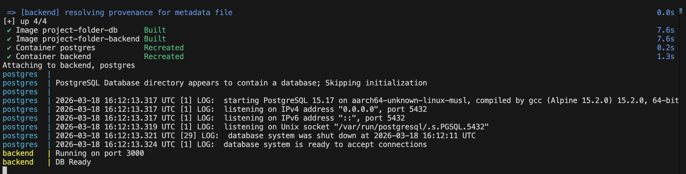
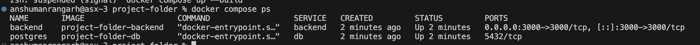
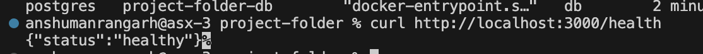
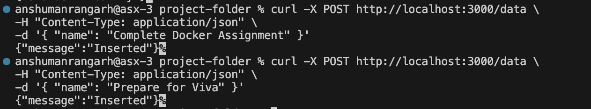
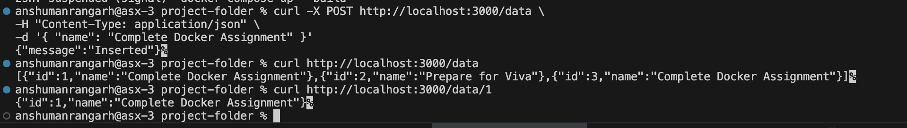

# Containerized Node.js & PostgreSQL Application

A production-oriented web application demonstrating Docker containerization, multi-service orchestration, networking, and persistent storage. The backend is built using Node.js and connects to a PostgreSQL database.


## 1. Network Configuration

### ❌ macvlan / ipvlan Not Implemented

The assignment required macvlan/ipvlan networking, but it was **not feasible due to macOS limitations**.

### 🔍 Reason

- Docker Desktop on macOS runs inside a **virtual machine**
- Host network interfaces (like `en0`) are **not directly accessible**
- macvlan/ipvlan require **direct access to physical network interfaces**

### ⚠️ Errors Encountered

```bash
invalid subinterface vlan name en0
no configured subnet contains IP address
Cannot connect to Docker daemon
```

## Alternative Used: Bridge Network
```bash
networks:
 mynet:
   driver: bridge
 ```

✔ Benefits

Fully supported on macOS 
Automatic DNS resolution (db, backend),
Simple and stable
No manual configuration required


## 2. Deployment

Dockerfiles:
 - [Backend/Dockerfile](./Backend/Dockerfile)
```
 FROM node:18-alpine AS builder

WORKDIR /app
COPY package*.json ./
RUN npm install

COPY . .

FROM node:18-alpine
WORKDIR /app

COPY --from=builder /app .

RUN adduser -D appuser
USER appuser

EXPOSE 3000
CMD ["node", "app.js"]
```
 - [Database/Dockerfile](./Database/Dockerfile)
```FROM postgres:15-alpine

ENV POSTGRES_USER=admin
ENV POSTGRES_PASSWORD=secret
ENV POSTGRES_DB=mydb
```

#### [docker-compose.yml](./docker-compose.yml)
```services:
  db:
    build: ./database
    container_name: postgres
    volumes:
      - pgdata:/var/lib/postgresql/data
    networks:
      - mynet
    restart: always

  backend:
    build: ./backend
    container_name: backend
    depends_on:
      - db
    networks:
      - mynet
    environment:
      DB_HOST: db
      DB_USER: admin
      DB_PASSWORD: secret
      DB_NAME: mydb
    ports:
      - "3000:3000"
    restart: always

volumes:
  pgdata:

networks:
  mynet:
    driver: bridge
```

Build and start the application stack. The backend container is configured to wait until the PostgreSQL database is fully healthy before booting.
```bash
docker compose up --build
```



## 3. API Usage

The backend API is exposed at 192.168.1.51:8000. All endpoints (except health) require the header Authorization: supersecretcode.



Insert Task (POST)
```Bash
curl -X POST http://localhost:3000/data \
-H "Content-Type: application/json" \
-d '{ "name": "Complete Docker Assignment" }'
```


Retrieve a task (GET)
```Bash
curl http://localhost:3000/data
```


Retrieve a specific task(GET)
```Bash
curl http://localhost:3000/data/1
```


## 4. Teardown & Clean Up

To stop the containers while safely persisting the database records in the Docker volume:
```Bash
docker compose down
```